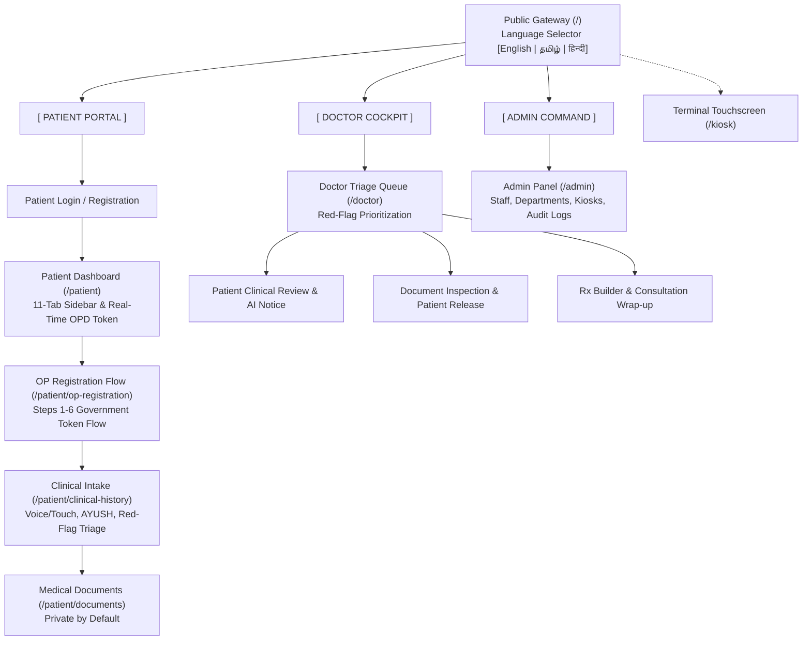

# MediKiosk: Indian Government Hospital Digital Clinical Intake Platform

MediKiosk is a mission-critical digital clinical intake platform engineered specifically for high-volume Outpatient Departments (OPD) in Indian Government Hospitals. It streamlines patient registration, captures structured clinical history through conversational multilingual input, facilitates medical document upload with physician-controlled privacy, and equips doctors with synthesized clinical summaries before consultations.

---

## 🏥 Context & Problem Statement

In Indian tertiary government hospitals and medical college hospitals, outpatient clinics frequently manage 300–800 patients per physician per day. Doctors have on average **2 to 5 minutes** per consultation. A major portion of this limited time is spent on repetitive administrative intake:
- Eliciting basic chief complaints, onset, duration, and pain scores.
- Unraveling unorganized physical paper records, old prescription slips, and outside diagnostic reports.
- Manual data entry into hospital registers.

### The Solution
MediKiosk relocates clinical history taking and document scanning to self-service touch terminals and a dedicated patient portal:
1. **Self-Service Token Dispensation**: Fast 6-step OP registration with ABHA and UHID generation.
2. **Conversational Clinical Intake**: Multilingual voice and touch chip intake (with optional AYUSH parameters and red-flag triage detection).
3. **Doctor-Controlled Medical Privacy**: Diagnostic documents are private by default until clinically reviewed and explicitly released by the doctor.
4. **Physician Cockpit**: Prioritized triage queues, AI-structured summaries with mandatory verification banners, e-prescription generation, and consultation wrap-up.

---

## 🌐 Multilingual Support (i18n)

MediKiosk features native, zero-refresh multilingual internationalization across 3 core languages:
- **English** (`en`, default)
- **Tamil — தமிழ்** (`ta`)
- **Hindi — हिन्दी** (`hi`)

### Multilingual Features
- Centralized `LanguageProvider` with synchronized document attributes (`<html lang="..." dir="ltr">`).
- Reusable `LanguageSwitcher` in public headers, dashboard navigation, and kiosk touch headers displaying native scripts (`English`, `தமிழ்`, `हिन्दी`).
- Dynamic Web Speech API acoustic locale binding (`en-IN`, `ta-IN`, `hi-IN`) with graceful fallback to interactive touch chips.
- **Medical Data Shielding**: Patient names, doctor credentials, ABHA numbers, UHIDs, OP numbers, prescription dosages, and numerical laboratory values are preserved verbatim and never translated.

---

## 👥 Core Workflows



### 1. Patient Experience
- **Authentication & Self-Registration**: Secure registration with ABHA ID, name, contact, and password.
- **OP Registration Flow**: 6-step wizard generating standard Government Hospital token numbers (`TKN-XXX`) and OP numbers (`OPD-2026-XXXXXX`) across specialties (General Medicine, Cardiology, Pediatrics, Orthopedics, AYUSH).
- **Conversational Intake**: Voice input and touch symptom chips (fever, cough, chest pain, trauma, etc.), duration, severity, and AYUSH dosha queries. Red-flag symptoms trigger immediate emergency triage banners.
- **Medical Documents**: Upload lab reports, diagnostic scans, and discharge summaries (stored privately by default).
- **Health Records**: 10-tab consolidated view of vitals, prescriptions, investigations, consultations, and immunizations.

### 2. Doctor Cockpit
- **Triage Queue**: Real-time queue prioritized by acuity (`Urgent / Red Flag` &rarr; `Priority` &rarr; `Normal`).
- **AI Summary Inspection**: Structured chief complaints, timeline, and vitals accompanied by an explicit `"REQUIRES DOCTOR REVIEW"` banner.
- **Doctor-Controlled Visibility**: Doctors inspect uploaded documents and explicitly click `"Make Visible to Patient"` to release them.
- **Prescription Builder**: Multi-item drug regimens (1-0-1 frequency, duration, precautions) with instant printable prescription slips.
- **Consultation Closure**: Consultation wrap-up automatically updates patient status to `Completed`.

### 3. Admin Command Center
- **Operational Metrics**: Real-time counts of registered patients, active OPD queues, priority cases, and active doctors.
- **Department & Doctor Management**: Roster monitoring, specialty allocation, and kiosk station health.
- **Security & Audit Logs**: Immutable audit trails recording logins, clinical intake submissions, document releases, and access denials.

---

## 🔒 Security & Privacy Architecture

| Control | Implementation |
| :--- | :--- |
| **Document Privacy by Default** | All patient-uploaded records start with `visibility: 'Private'`. Patients cannot download or view documents until the consulting physician marks them as `Released`. |
| **Direct URL Bypass Prevention** | Static express file serving for `/uploads` is disabled. All file downloads require authenticated access through `/api/documents/:id/file`. |
| **Role-Based Access Control (RBAC)** | Route-level middleware (`authenticateUser`, `requireRole`) blocks unauthorized access (Patients attempting to view Doctor or Admin endpoints receive `403 Forbidden`). |
| **Patient Data Isolation** | Patient B cannot access Patient A's medical records or documents even if released. |
| **Auditing & Traceability** | Sensitive actions (login, registration, document release, access rejection) generate structured `AuditLog` records. |

---

## 🛠️ Technology Stack

- **Frontend**: Next.js 14 (App Router), React 18, TypeScript, Tailwind CSS, Lucide Icons.
- **Backend**: Node.js, Express.js (REST API), Socket.IO (Real-time synchronization).
- **Database**: MongoDB with Mongoose ODM.
- **Authentication**: Stateless JSON Web Tokens (JWT) with bcrypt password hashing.
- **AI & OCR Architecture**: Local Ollama service integration with DeepSeek-R1, coupled with deterministic fallbacks and OCR text extraction abstractions.

---

## 📁 Project Structure

```text
Medikosiko/
├── backend/
│   ├── config/              # MongoDB connection & configuration
│   ├── middleware/          # JWT authentication, RBAC, and audit logging
│   ├── models/              # Mongoose schemas (User, Patient, Doctor, Prescription, etc.)
│   ├── routes/              # Express route controllers (/auth, /patients, /doctors, etc.)
│   ├── services/            # Local AI (Ollama) and OCR extraction services
│   ├── tests/               # Automated test suites (Jest & Supertest)
│   ├── uploads/             # Secure directory for patient medical uploads (.gitkeep)
│   ├── .env.example         # Template for backend environment variables
│   ├── index.js             # Express application and Socket.IO server entrypoint
│   └── package.json         # Backend dependencies & test scripts
├── frontend/
│   ├── public/              # Static assets and icons
│   ├── src/
│   │   ├── app/             # Next.js App Router (public, patient, doctor, admin, kiosk)
│   │   ├── components/      # Shared components (Navbar, LanguageSwitcher, VoiceInput)
│   │   ├── contexts/        # LanguageContext (React i18n state)
│   │   ├── locales/         # Localized JSON dictionaries (en.json, ta.json, hi.json)
│   │   └── lib/             # Central API client (api.ts) and Socket.IO client (socket.ts)
│   ├── .env.example         # Template for frontend environment variables
│   ├── next.config.js       # Next.js configuration with API proxy rewrites
│   ├── tailwind.config.ts   # Tailwind styling and high-contrast hospital color palette
│   └── package.json         # Frontend dependencies & Next.js scripts
├── .gitignore               # Root ignore rules for dependencies, secrets, and uploads
└── README.md                # Project documentation
```

---

## ⚙️ Environment Setup & Installation

### Prerequisites
- Node.js (v18 or higher recommended)
- MongoDB Community Server (v6.0 or higher) running locally on port 27017
- (Optional) [Ollama](https://ollama.ai/) with DeepSeek model for local AI synthesis

---

### Step 1: Clone the Repository
```bash
git clone <repository_url>
cd Medikosiko
```

---

### Step 2: Configure Environment Variables

#### Backend Configuration
Copy `backend/.env.example` to `backend/.env`:
```bash
cp backend/.env.example backend/.env
```
Ensure `backend/.env` contains:
```env
PORT=5000
MONGODB_URI=mongodb://127.0.0.1:27017/medikiosk
JWT_SECRET=your_secure_jwt_secret_key_here
OLLAMA_BASE_URL=http://localhost:11434
OLLAMA_MODEL=deepseek-r1:8b
CLIENT_URL=http://localhost:3000
```

#### Frontend Configuration
Copy `frontend/.env.example` to `frontend/.env.local`:
```bash
cp frontend/.env.example frontend/.env.local
```
Ensure `frontend/.env.local` contains:
```env
NEXT_PUBLIC_API_URL=http://localhost:5000
NEXT_PUBLIC_SOCKET_URL=http://localhost:5000
```

---

### Step 3: Install Dependencies

```bash
# Install backend dependencies
cd backend
npm install

# Install frontend dependencies
cd ../frontend
npm install
cd ..
```

---

### Step 4: Run the Application

#### Start the Backend Server (Port 5000)
```bash
cd backend
npm start
```
*The backend connects to MongoDB and listens on `http://localhost:5000`.*

#### Start the Frontend Development Server (Port 3000)
```bash
cd frontend
npm run dev
```
*The frontend will be available at `http://localhost:3000`.*

---

## 🧪 Testing & Verification

### Automated Backend Tests
Run the complete automated test suite (verifying authentication, OPD registration, clinical intake, document privacy controls, doctor queue, prescriptions, and multilingual dictionary integrity):
```bash
cd backend
npm test
```
*All 26 test cases across `api.test.js` and `i18n.test.js` pass with 100% success.*

### Frontend Linting & Build
```bash
cd frontend
npm run lint
npm run build
```
*Generates and optimizes all 25 static application pages with zero errors.*

---

## 🔍 Known Limitations & Architectural Notes

1. **ABDM / FHIR Compliance**: The application architecture models ABHA IDs, UHIDs, and consent flows following Indian National Health Authority (NHA) design guidelines. Live production integration with the live Ayushman Bharat Digital Mission (ABDM) sandbox/gateway requires official ABDM partner sandbox credentials and cryptographic token signing.
2. **Local AI & Ollama Fallback**: The AI clinical summarizer utilizes a local Ollama instance (`deepseek-r1:8b`). If Ollama is offline or unavailable, the backend seamlessly falls back to a deterministic, rule-based clinical structuring engine without interrupting patient care.
3. **Medical OCR**: Physical document digitization includes a local OCR extraction abstraction. For handwritten clinical case notes in clinical production, integration with high-precision cloud or on-premise medical vision APIs is recommended.
4. **Voice Input**: Speech-to-text uses the standard Web Speech API with language acoustic models (`ta-IN`, `hi-IN`, `en-IN`). In offline kiosk environments without browser cloud speech engines, direct integration with edge voice engines (e.g. Bhashini / AI4Bharat) is recommended.

---

## 📜 License & Acknowledgments

Developed for Indian Public Healthcare and Government Hospital OPD workflow modernization. All medical intake forms adhere to standard clinical documentation guidelines.
